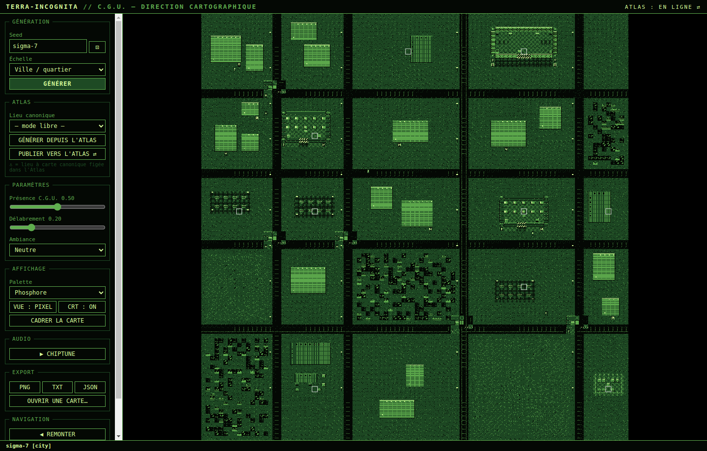
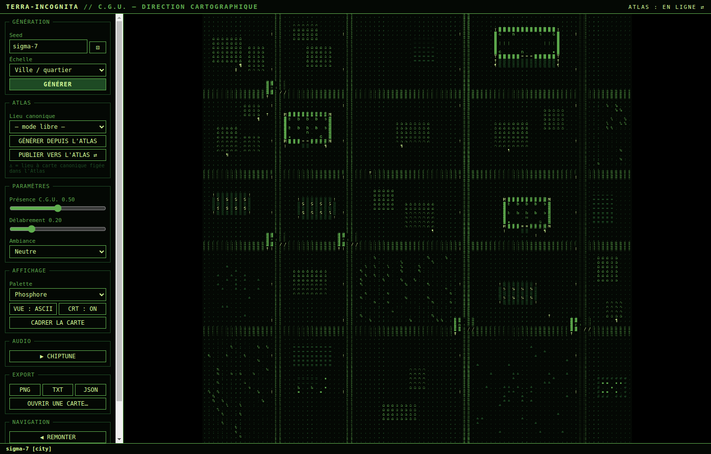
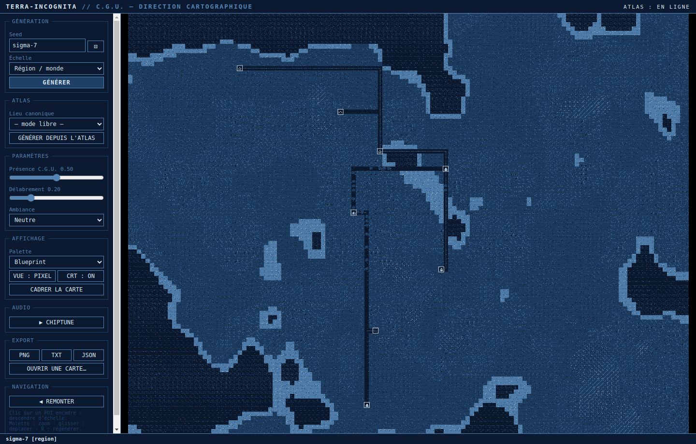

# Terra-Incognita

> **Générateur de cartes procédural rétrofuturiste** pour l'univers **ROBŌTARIIS**.
> Une seed + le lore de l'Atlas → une carte pixel art 1940-1960 sous contrôle martial du C.G.U.


**▶ [Démo web jouable](https://obareau.github.io/terra-incognita/)** — génération, vues pixel/ASCII,
chiptune et exports dans le navigateur (mode libre ; le lien Atlas ⇄ est réservé à l'app desktop).

**📻 [Radio Robōtariis](https://obareau.github.io/terra-incognita/radio/)** — jukebox chiptune généré
à la volée, avec speakerine en synthèse vocale : votre date de naissance × l'instant où vous allumez
le poste = votre onde personnelle. La grille des programmes suit l'heure (marches le matin, blues
clandestin le soir, requiems la nuit) — et chaque onde ne s'entend qu'une seule fois dans une vie.

Terra-Incognita génère des cartes **entièrement procédurales** à trois échelles, dans une esthétique
Game Boy / écran radar : tiles pixel art 16×16 **dessinés par le code** (zéro asset externe),
macros « Lego » (caserne C.G.U., checkpoint, marché noir…), vue ASCII/TUI, chiptune génératif,
et lien **bidirectionnel** avec l'**Atlas** (la base de lore locale de l'univers) : le canon
pilote la génération, et les cartes générées enrichissent le canon en retour.



| Vue ASCII/TUI (même carte) | Région, palette blueprint |
|---|---|
|  |  |

La même carte s'exporte en pixel art PNG, en JSON rechargeable, ou en ASCII brut :

```
█,,,,,,,,,,,,,,,░░,,M▓▓▓▓▓▓▓▓▓M,░░,,,,,,¶,,,,,,,,,,,░░,,%%;;;,,█
█⌂⌂⌂⌂⌂⌂⌂,,,,,,,,░░,,▓b.b.b.b.b▓,░░,,,,,,,⌂⌂⌂⌂⌂⌂,,,,,░░,;,,,,,;,█
█,⌂⌂⌂⌂⌂⌂⌂,,,,,,,░░,,▓....n....▓,░░,,⌂⌂⌂⌂⌂⌂⌂⌂,,,,,,,,░░,,;;,,,,,█
█,⌂⌂⌂⌂⌂⌂⌂,,,,,,!░░,,▓▪......G.▓!░░,,⌂⌂⌂⌂⌂⌂⌂⌂,,,,,,,!░░,,;;;,;,;█
█,⌂⌂⌂⌂⌂⌂⌂,,,,,,,░░,,M▓▓▓==▓▓▓▓M,░░,,,,,,,,,,,,,,,,,,░░,;;;,,,,;█
█,⌂⌂⌂⌂⌂⌂⌂,,,,,,,░░,,†...▒▒...¶,,░░,,,,⌂⌂⌂⌂,,,,,,,,,,░░,,;,;%,,;█
=░░░░░░░░░░░░░▓▓░//░░░░░░░░░░░░░░░░░░░░░░░░░░░░░░░░░░░░░░░░░░░=
```
*(caserne C.G.U. avec miradors `M`, couchettes `b` et portail `==` ; immeubles `⌂` ;
checkpoint `//` sur l'avenue ; bannières `†` et propagande `¶` ; ruines `;%`)*

---

## Lancer

```bash
npm install
npm start          # build esbuild + Electron
npm test           # invariants : déterminisme, connexité BSP, mapping Atlas…
npm run package    # binaire portable (electron-builder)
```

L'intégration Atlas est optionnelle : si l'Atlas tourne en local (port 5557, configurable via
`ATLAS_URL`), le sélecteur « Lieu canonique » se remplit ; sinon l'app retombe sur son cache
disque, puis sur le mode libre.

## Utilisation

| Action | Effet |
|---|---|
| **Seed + GÉNÉRER** | même seed = même carte, toujours |
| **GÉNÉRER DEPUIS L'ATLAS** | le nœud choisi (Sigma-7, Terre…) fixe seed, échelle et paramètres depuis ses tags/relations — ou depuis sa carte canonique ⚓ si elle a été publiée |
| **PUBLIER VERS L'ATLAS ⇄** | écrit dans l'Atlas : les POI (QG, casernes, marchés, villes…) deviennent des nœuds `lieu` reliés en `membre` au lieu parent, et la carte est **figée comme canon** dans ses notes |
| Clic sur un **POI encadré** | descend d'échelle : région → ville → intérieur (seed dérivée, déterministe) |
| `R` / `V` / `F` / `Backspace` | régénérer / basculer pixel↔ASCII / cadrer / remonter |
| Molette / glisser | zoom (0.25×–4×) / déplacer |
| **PNG / TXT / JSON** | export image, ASCII brut, sauvegarde rechargeable |

Paramètres de génération : **Présence C.G.U.** (0 = absent, 1 = état de siège : enceinte,
checkpoints, miradors, propagande), **Délabrement** (friches, ruines, cendres), **Ambiance**
(neutre, militaire, industriel, clandestin, ruine), **Palette** (phosphore, sépia, blueprint).

## Styles d'architecture par faction

Chaque faction connue impose un archétype architectural dérivé de son caractère canon
(`core/factions/styles.ts`). En mode Atlas, la **faction dominante** du lieu (relations
`membre` > `allie` > `connecte`) choisit le style ; un sélecteur permet de forcer.

| Archétype | Factions types | Signature |
|---|---|---|
| **Martial** | C.G.U., Clīpeātī Unītās, Dark Umbrae | murs métal, miradors, propagande, peu d'arbres |
| **Liturgique** | Pasteurs de la Rectitude, Illuminés | esplanades de cérémonie, bannières, avenues éclairées |
| **Clandestin** | Voile d'Ombre, Renégats, Union Clandestine | marchés denses, graffitis, rues sombres |
| **Organique** | Gardiens des Jardins, Protecteurs Verts | grillages plutôt que murs, parcs, ville plantée |
| **Industriel** | Magnats, Barons Technologiques, Mécanistes | usines, machines, rues éclairées (la stabilité paie) |
| **Civique** | Archivistes Libres, Continui Numeri | blocs réguliers, propreté, ni graffiti ni propagande |

## Architecture

```
src/
├── core/            # logique PURE (zéro DOM/Electron, zéro Math.random) → testée par jest
│   ├── rng.ts       # sfc32 seedé, sous-seeds par domaine, childSeed des POI
│   ├── palettes.ts  # 3 palettes 4 tons
│   ├── tiles/       # registre des tiles + recettes de pixel art procédural
│   ├── autotile.ts  # bitmask 4 voisins (routes, murs, toits)
│   ├── macros/      # prefabs ASCII : caserne, checkpoint, QG, marché, parc…
│   ├── gen/         # region (fBm+POI), city (blocs→zonage→macros), interior (BSP)
│   ├── atlas/       # mapping tags/relations Atlas → GenParams
│   └── serialize.ts # JSON ↔ MapData, export ASCII
├── atlas/client.ts  # fetch /api/graph (main process), cache userData, fallback
├── main.ts          # fenêtre, IPC (atlas, exports), mode --screenshot=x.png
├── preload.ts       # contextBridge → window.terra
└── renderer/        # UI, vue pixel (canvas), vue ASCII, chiptune WebAudio
```

## Lien bidirectionnel avec l'Atlas

**Atlas → carte** (`core/atlas/mapping.ts`) : un lieu `membre` du C.G.U. hérite d'une densité
militaire élevée ; un tag `voile-ombre` bascule en ambiance clandestine ; une `planete` s'ouvre
à l'échelle région ; des relations `ennemi` sèment des zones contestées.

**Carte → Atlas** (`core/atlas/publish.ts`) : la publication — **toujours explicite**, jamais
automatique — crée les POI significatifs comme nœuds canoniques (tag `terra-incognita`,
relation `membre` vers le lieu parent, seed enfant dans les métadonnées) et écrit un marqueur
`[terra-incognita] {seed, scale, params}` dans les notes du lieu. Ce marqueur **fige la carte
canonique** : toute régénération future du lieu (repérée ⚓ dans le sélecteur) reproduira
exactement la même carte, même si le mapping heuristique évolue. La publication est idempotente
(ids stables, dédoublonnage côté API).

## Documents

- [ROADMAP.md](ROADMAP.md) — phases, jalons, idées post-v1
- [DECISIONS.md](DECISIONS.md) — choix retenus, **options écartées et pièges rencontrés**

Fait partie de l'écosystème **ROBŌTARIIS** (Atlas, timeline, radio…).
